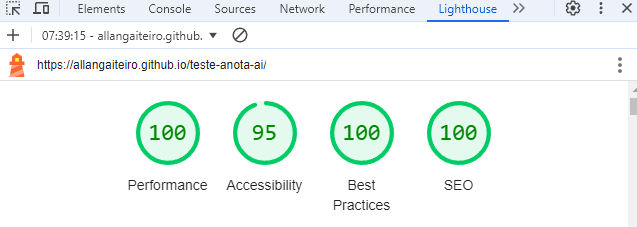
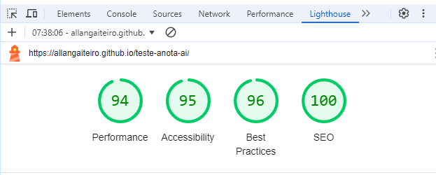

# TesteAnotaAi


[](https://allangaiteiro.github.io/teste-anota-ai/)

This project was created for a test for Anota AI, with the goal of completing all the tasks listed below.

## Tasks

1. Create a workspace and an initial application with the Angular 2+ framework,
preferably Angular 17.
2. Create the Header of the page.
3. Create a list of cards. For, this you’ll need to send a HTTP GET request to the URI
below to receive the JSON list:
https://githubanotaai.github.io/frontend-interview-mock-data/cardlist.json
3.1. Use the following reference for the type names:
Type 1: Paisagem
Type 2: Flor
Type 3: Pizza
4. Insert an option to delete card (the card must be removed from the list on the
front-end)
5. Insert a “search field” and implement a product filtering feature where the user can
filter the cards by title or description.

### Bonus Tasks
1. If you're comfortable writing unit tests, we would greatly appreciate it.
1. 1. While we do prefer Jest, if you prefer to use Karma/Jasmine, that's perfectly fine
too.


## Tecnologias utilizadas

<table>
    <tr>
        <td><a href="https://angular.io/" title="Angular"></a></td>
        <td><a href="https://www.w3.org/html/" title="HTML"></a></td>
        <td><a href="https://www.w3schools.com/css/" title="CSS"></a></td>
        <td><a href="https://www.javascript.com/" title="JavaScript"></a></td>
    </tr>
</table>

## Development server

1. Download the repository to your machine:

```
git clone https://github.com/AllanGaiteiro/teste-anota-ai.git
```

2. Then, navigate to the project directory and install the dependencies using the command:

```
npm install
```

3. Start the application locally:

```
ng serve
```

4. Access the application in your browser at:

```
http://localhost:4200/
```

## Running unit tests

Run `ng test` to execute the unit tests via [Karma](https://karma-runner.github.io).

## Deploy

The project is hosted on Firebase and can be accessed via the following link:

[](https://allangaiteiro.github.io/teste-anota-ai/)

To deploy it to another server, simply follow the instructions in the Angular framework documentation or the server of your choice.


## Performarce

Performance tests were conducted using the browser's developer tools and the MozBar extension. These tools provided insights into load times, responsiveness, and other metrics critical for ensuring a smooth user experience. The results helped identify potential areas for optimization, such as improving image formats, reducing unused JavaScript, and enhancing text compression.

link: https://allangaiteiro.github.io/teste-anota-ai/
### Descktop


### Mobile
